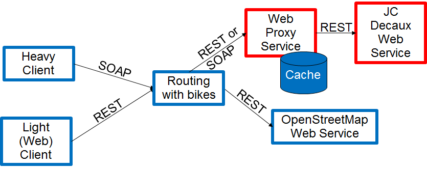

### Author: Rachid EL ADLANI

# Context
Application which would allow the user to find its way from any location to any other location (in a same city for a first release) by using as much as possible the bikes offered by JC Decaux.

# Architecture


# Features
* __Display the shortest path between two adresses for the client__
* __Display statistics of usages for administrator__

# API used
* Openrouteservice API from OpenStreetMap: for getting routes 
* OpenLayers for light web client: for printing the map

# Process for client usage

* Make sure that the ports ```10001-10002-10003-8733-8734```
* Run as administrator the executable located in the folder: ```LetGoBiking\ProxyCacheJC\HostProxy\bin\Debug\Hostproxy.exe```
* Run as administrator the executable located in the folder: ```LetGoBiking\RoutingBikes\HostRoutingBikes\bin\Debug\HostRoutingBikes.exe```
* Run the light client (python server) : ```python.exe LetGoBiking\GOBIKING\server.py```
* Light client will be available on : ```localhost:8009```

# Process for admin usage

* Run the heavy client (.NET core 3.1 project): ```LetGoBiking\HeavyClient\HeavyClient\bin\Debug\netcoreapp3.1\HeavyClient.exe```
* In order to see the different available commands with their infos, run command: ```help```
